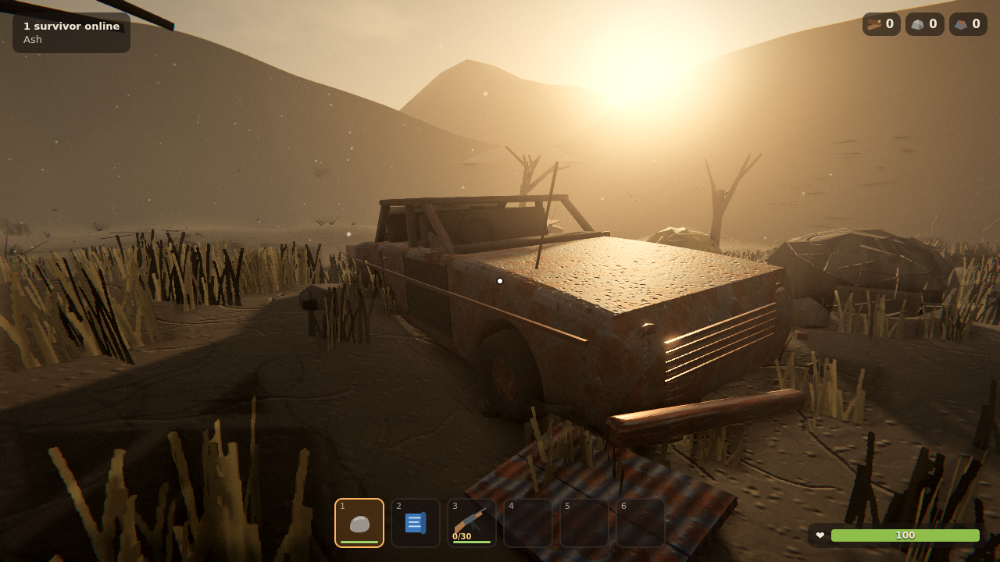
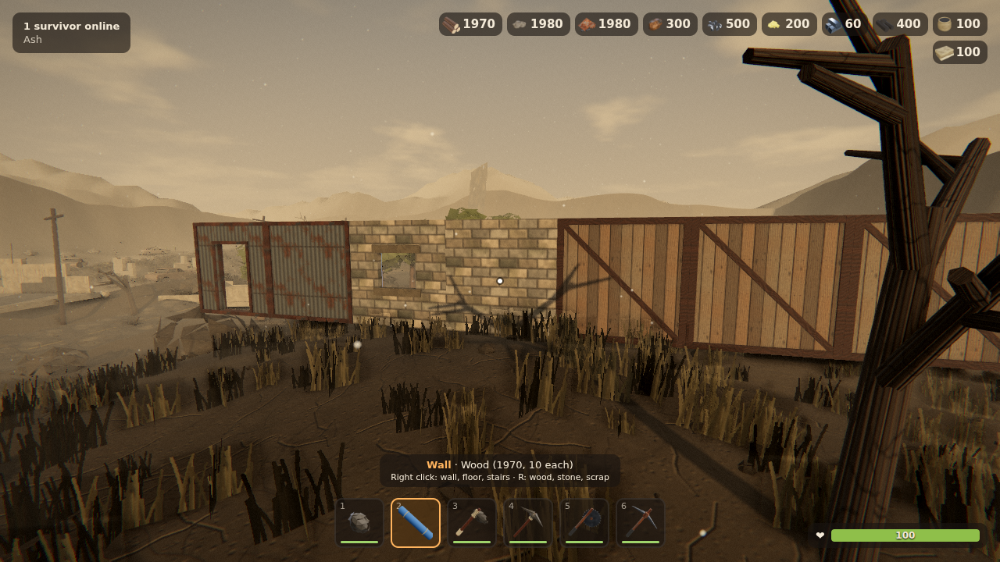
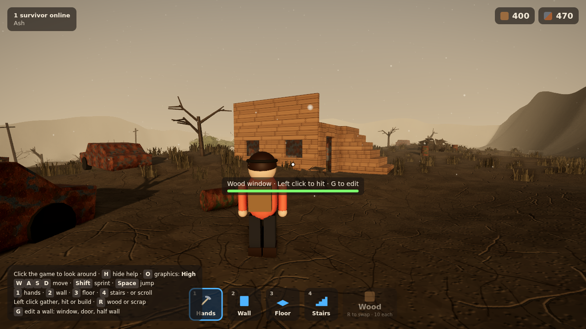

# Primal Frontier

A survival sandbox set in a world after a nuclear apocalypse. Players join a server, scavenge a barren map for wood, stone, scrap, ores and hemp, craft tools and guns, build, and fight. The full vision is Rust-style survival with ARK-style creatures, Minecraft-style building and Fortnite-style characters on servers that wipe every 30 days.

This repository is the **browser prototype**, built step by step. Milestones done: **walk, gather, build**, **better graphics with Fortnite-style building**, **Rust-style crafting**, **Rust-style weapons**, **armour with punchier combat sounds**, a **polish pass** and **survival: hunger, thirst and radiation**.







## What works now

- A 160 m barren wasteland generated from a seed: ash plains, blast craters, dead trees, burnt-out cars, ruined concrete houses, leaning power poles, boulders and one small pocket of living trees.
- Graphics: a hazy low-sun sky with drifting clouds, height fog that pools in low ground and glows toward the sun, light shafts, soft 4K shadows, materials with roughness detail, dense dry grass that sways in the wind, drifting ash, ambient occlusion, bloom and a filmic grade with grain.
- Items look like the real thing: inventory icons are rendered from 3D models (logs, ore, ingots, cartridges, every tool and gun). Walls are built from weathered boards in a timber frame, coursed stone blocks with lintels, or rusty corrugated steel on steel posts. Guns have shaped stocks, curved magazines, sights and rails; tools have lashed flint heads, saw blades and taped grips. Press **O** to switch to low graphics on slower computers.
- Up to 8 players per server, each a gritty hooded survivor with goggles, a respirator, a loaded backpack and whatever tool is on their belt, in muted clothing with a faded colour on their scarf and armband so players stay easy to tell apart. Walking, sprinting and chopping each have their own animation.
- Gathering: hit trees for wood, wrecks for scrap, boulders for stone, metal ore, sulfur ore and rare high quality metal ore, and press E on hemp for cloth. Trees never regrow; the rest respawn after a few minutes. You spawn with a rock and a building plan.
- Rust-style inventory: a 6-slot belt and a 24-slot backpack. Drag stacks between slots, shift-drag to split, right click to quick-move.
- Crafting (Tab): a queue that crafts over time and refunds when cancelled. Stone hatchets and pickaxes gather much faster than the rock; salvaged tools are faster again but need a workbench nearby. Tools wear out and break.
- Deployables: workbenches (levels 1, 2 and 3), a furnace that burns wood into charcoal while smelting metal, sulfur and high quality ore, and a 12-slot storage box. Hit one to pick it back up.
- Weapons, Rust-style: spears, a machete and a salvaged sword; the hunting bow and crossbow; the Eoka, waterpipe, revolver and double barrel; the semi-auto pistol, pump shotgun, Thompson, custom SMG and semi-auto rifle (workbench 2); the MP5, assault rifle, LR-300, bolt action rifle, L96 and M249 (workbench 3). Five ammo types are crafted from gunpowder (charcoal and sulfur). Guns have magazines, reloads, recoil, spread, damage falloff and headshots; scoped rifles zoom right in.
- Armour: burlap (cloth), road sign (workbench 1) and welded metal (workbench 2) pieces for the head, chest and legs. Each blocks a share of the damage on the part it covers (10%, 30% and 45-50%), wears down as it takes hits and shows on your survivor. Wear it from the Armour row in the inventory, by right clicking it, or by left clicking it on your belt. Worn armour goes in your loot bag when you die.
- Sound: every gun has its own synthesised shot, layered from a supersonic crack, a low punch and the blast's body, with an echo that takes over at range and stereo panning. Bolt rifles cycle their bolt, the pump shotgun racks, reloads click, and hits thud, ping off helmets and clank on your own armour.
- Everything else has a sound too: axes biting wood, picks on stone and ore, clanging scrap, trees creaking and crashing down, building pieces knocking into place and breaking apart, swings, footsteps that change on wood, stone and metal floors, landings, finished crafts, inventory moves and a low wind across the wasteland. Guns are mixed loudest, so a firefight cuts through everything.
- Feedback: chips of wood, stone and metal fly off whatever you hit, new pieces settle into place and shake when hit, items you pick up show as "+6 Wood" in the corner, a red arc shows which way a hit came from, and a kill feed lists every kill with the weapon and headshots. The crafting screen lists each ingredient against what you carry and has a Max button.
- Survival: food and water drain over time (faster on the move) and hurt you when they run out; keep both above half and you slowly heal. Drink from blue rain barrels (E), pick mushrooms (E), and find cans of beans and bottled water in the glove boxes of wrecks you scrap. The three blast craters are still radioactive: yellow signs mark the edges, a Geiger counter clicks faster the hotter it gets, and radiation poisoning builds up and starts to hurt. Burlap keeps some of it out, anti-radiation pills (charcoal and mushrooms) flush it, and the craters hold the richest high quality metal ore.
- Combat: 100 health, bandages and syringes to heal. Dying drops everything in a loot bag anyone can open, and you respawn with a rock. The server traces every shot, so walls and the ground stop bullets.
- Fortnite-style building on a 3 m grid with the building plan in hand: walls, floors and stairs in wood, stone or scrap (10 each). Walls can be edited into a window, a door or a half wall. Pieces must connect to the ground or another piece. Hit a piece to damage it; stone and scrap are tougher than wood.
- Movement handles everything you build: walk up stairs, stand on floors, walk through doors.
- The server checks every action (reach, cost, cooldowns, movement speed), so players can't cheat by editing the client.

## Controls

| Action | Key |
| --- | --- |
| Look around | Click the game, then move the mouse |
| Move / sprint / jump | WASD / Shift / Space |
| Pick a belt slot | 1 to 6 (or scroll) |
| Inventory and crafting | Tab or I (Esc closes) |
| Gather, hit, place or shoot what you hold | Left click (hold for automatic guns) |
| Aim down sights | Right click (with a gun) |
| Reload | R (with a gun) |
| Open a furnace or box, pick hemp or mushrooms, drink from a rain barrel | E |
| Eat, drink or take pills in your hands | Left click |
| Building plan: wall, floor or stairs | Right click |
| Building plan: wood, stone or scrap | R |
| Edit the wall you look at (window, door, half wall, solid) | G |
| Graphics high or low | O |
| Hide help | H |

## Play it on your computer

Install [Node.js](https://nodejs.org) 20 or newer, then:

```bash
npm install
npm run build
npm start
```

Open http://localhost:3000. Friends on the same network can join at `http://<your computer's IP>:3000`.

For development with live reload, run `npm run dev` and open http://localhost:5173.

## Host it online for friends

The repo includes a `render.yaml`. On [Render](https://render.com), choose **New > Blueprint**, pick this repository, and it builds and runs the server. Share the URL it gives you. The free plan sleeps when nobody is playing, so the first visit can take a minute to load.

## How it is built

| Folder | What it holds |
| --- | --- |
| `shared/` | Rules both sides use: terrain generation, resources, block costs, message types |
| `server/` | The authoritative game server (`game.ts` is pure logic, `index.ts` is networking) |
| `client/` | The Three.js game: graphics, world, character, building controls and screen layout |
| `tests/` | Unit tests for the game rules |
| `scripts/smoke.ts` | A two-player browser test that gathers, builds a hut with a door and window, walks up the stairs, and checks both players see it |

Checks: `npm run typecheck`, `npm test`, and `npm run build && npm run smoke`.

## Next milestones

1. The first creature: a mutated Ashhound that can be tamed and ridden (and hunted for meat to cook)
2. Saving the world to disk and the 30-day wipe cycle
